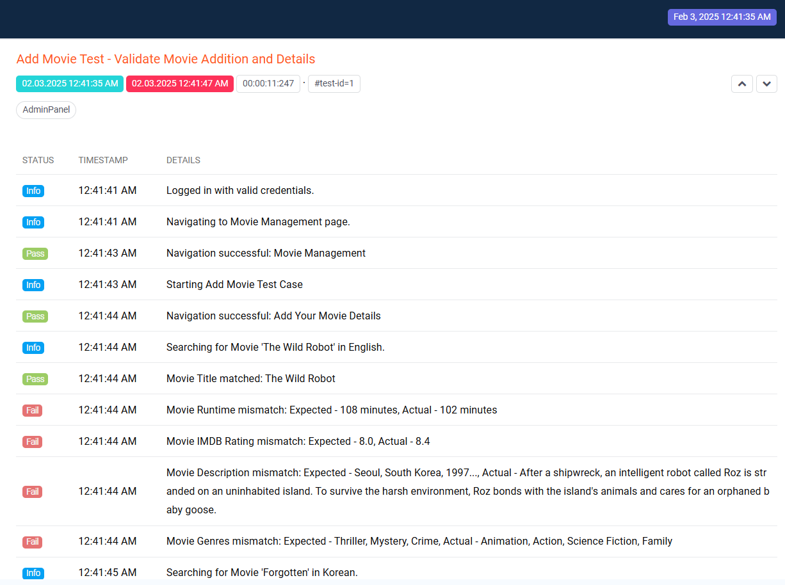
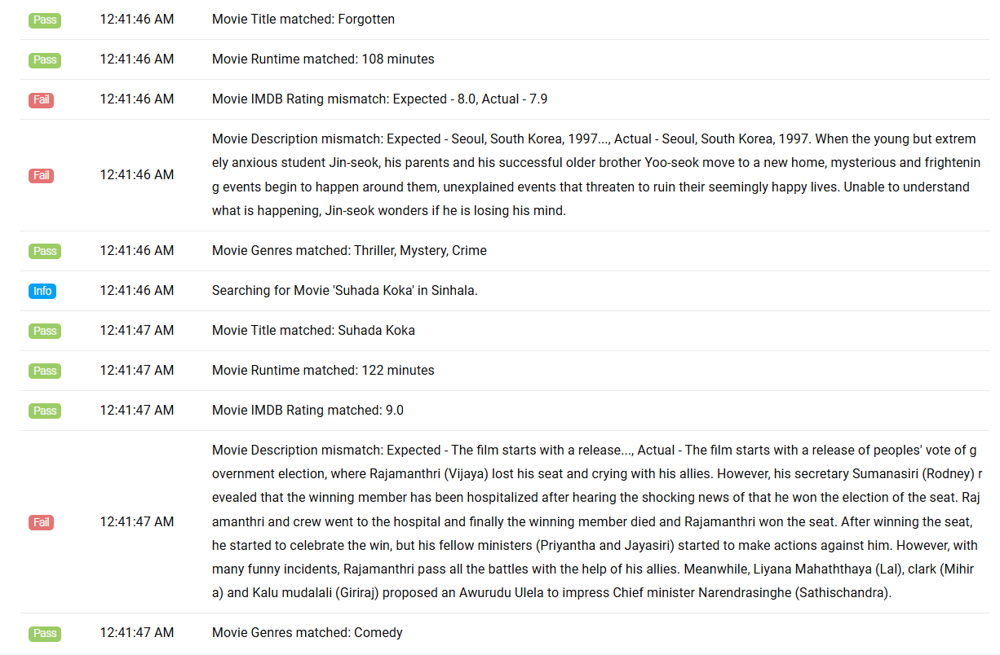
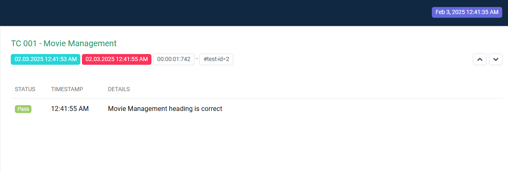
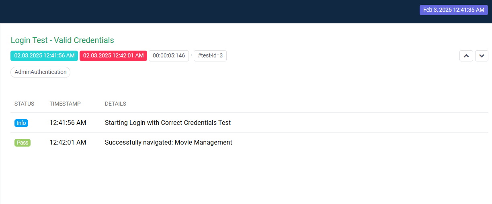
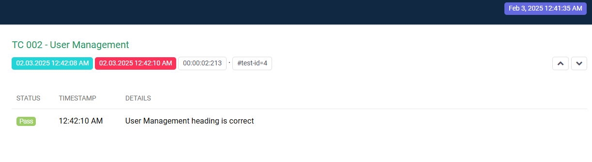
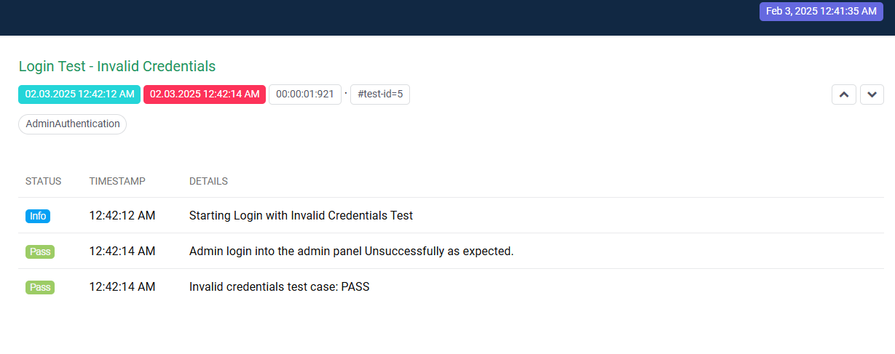
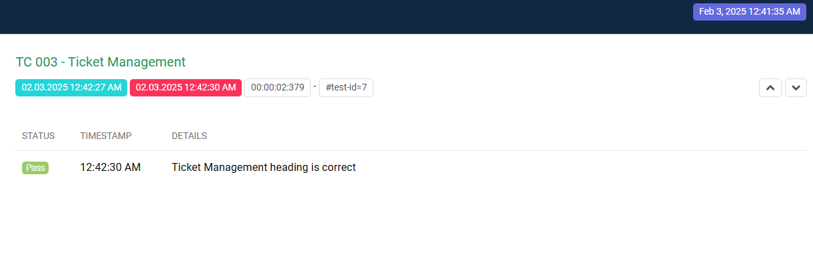
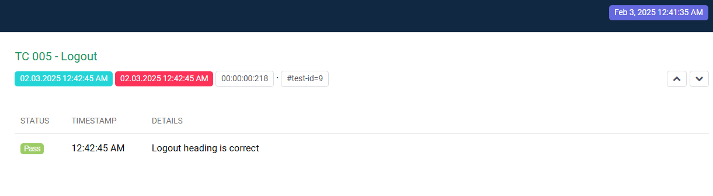

# ABC Cinema Admin Panel - Test Reports

This document provides an overview of the automation test reports for the **ABC Cinema Admin Panel**. The test cases below verify key features, including movie management, user management, login functionality, and more.

---

## Test Reports with Screenshots

### Test Report for Add Movie Test

#### Screenshot:
 

#### Report:
The movie was successfully added with the correct details, and a confirmation message appeared.

---

### Test Report for Movie Management

#### Screenshot:

#### Report:
The movie management functionality worked as expected. Admin was able to edit and delete movie records.

---

### Test Report for Login Test - Valid Credentials

#### Screenshot:

#### Report:
Admin logged in successfully using valid credentials and was redirected to the admin dashboard.

---

### Test Report for User Management

#### Screenshot:

#### Report:
Admin was able to add, edit, and delete user accounts without any issues.

---

### Test Report for Invalid Credentials Test

#### Screenshot:

#### Report:
Login attempt with invalid credentials failed, and an error message was displayed.

---

### Test Report for Add Movie Test - Validate Movie Addition and Details

#### Screenshot:

#### Report:
Movie was successfully added, and the movie details matched the input provided.

---

### Test Report for Ticket Management

#### Screenshot:

#### Report:
Ticket management functionality allowed for the successful addition, editing, and deletion of tickets.

---

### Test Report for Review Management

#### Screenshot:

#### Report:
Admin was able to manage reviews, including adding, editing, and deleting them.

---

### Test Report for Logout Test

#### Screenshot:

#### Report:
Admin successfully logged out and was redirected to the login page.

---

## Summary

The tests for the **ABC Cinema Admin Panel** were executed successfully, with all key features functioning as expected. Admin features such as movie management, user management, login, and ticket management were validated thoroughly.

---

## Future Test Plan

- **UI Enhancements**: Add more detailed UI testing for responsiveness across devices.
- **Performance Testing**: Simulate high traffic scenarios to ensure stable performance under load.
- **Security Testing**: Conduct security audits and penetration testing to identify and mitigate vulnerabilities.

For more details or issues, please refer to the test case results above.

---

**Date of Report Generation**: 03/02/2025  
**Tested by**: Thanuga Soysa
**Project Version**: v1.0